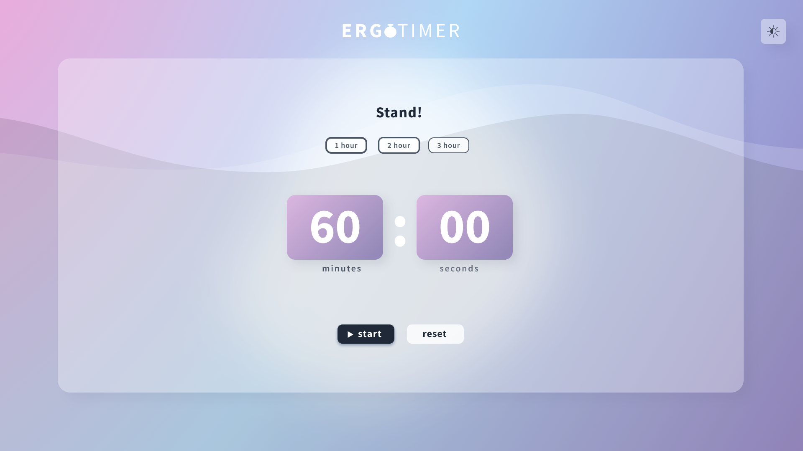
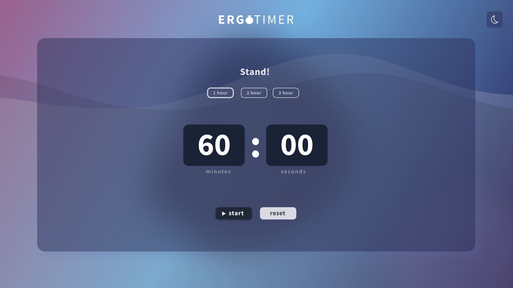

## ErgoTimer ⏱️⏱️⏱️

With working from home becoming the norm, it is easy to forget to take regular breaks while being computer bound all day. Studies have shown that being seated for long periods of time can have various detrimental health effects.

Therefore, inspired by the infamous Pomodoro App, the ErgoTimer provides automatic switching between 'sitting' and 'standing' with focused time buttons for the user to select based on the complexity of the task at hand.

The gentle wave animations in the background promote relaxation and calmness while working! 🌊🌊

### This was a pro bono project built for a friend wanting to maximise the use of his standing desk while working from home during the pandemic ✌️🧍

### In this project I aimed to learn more about: 🤓😄

- css variables
- css animations
- useState
- useEffect

